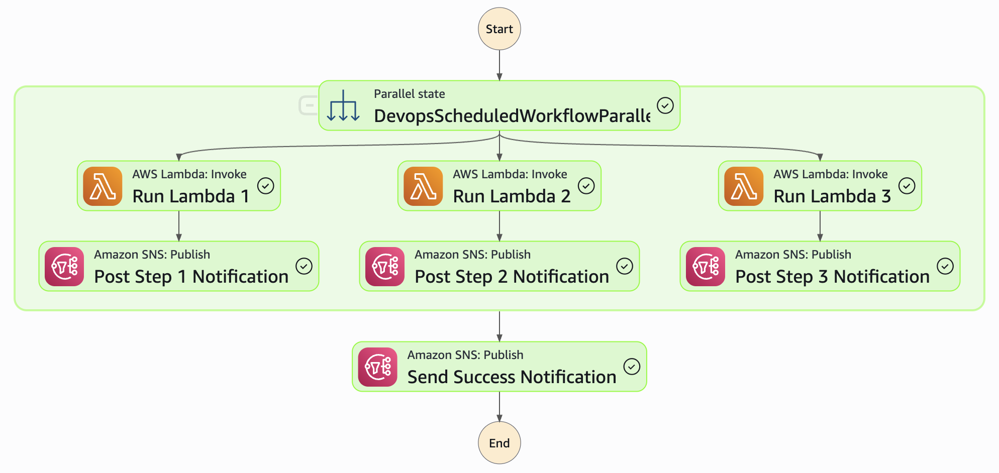

# Welcome to DevOps Scheduled Lambdas project!

This is a project to enable quick and easy deployment of new lambdas needed to be run on a schedule for DevOps purposes. Each lambda will be run in parallel and have an output step to notify of the results as shown here:

## Useful commands
* `okta-awscli  --force --profile DEVINT`
* `cdk deploy --profile DEVINT`     deploy updates to DEVINT

* `okta-awscli  --force --profile UAT`
* `cdk deploy --profile UAT`        deploy updates to UAT

* `okta-awscli  --force --profile PROD`
* `cdk deploy --profile PROD`       deploy updates to PROD

